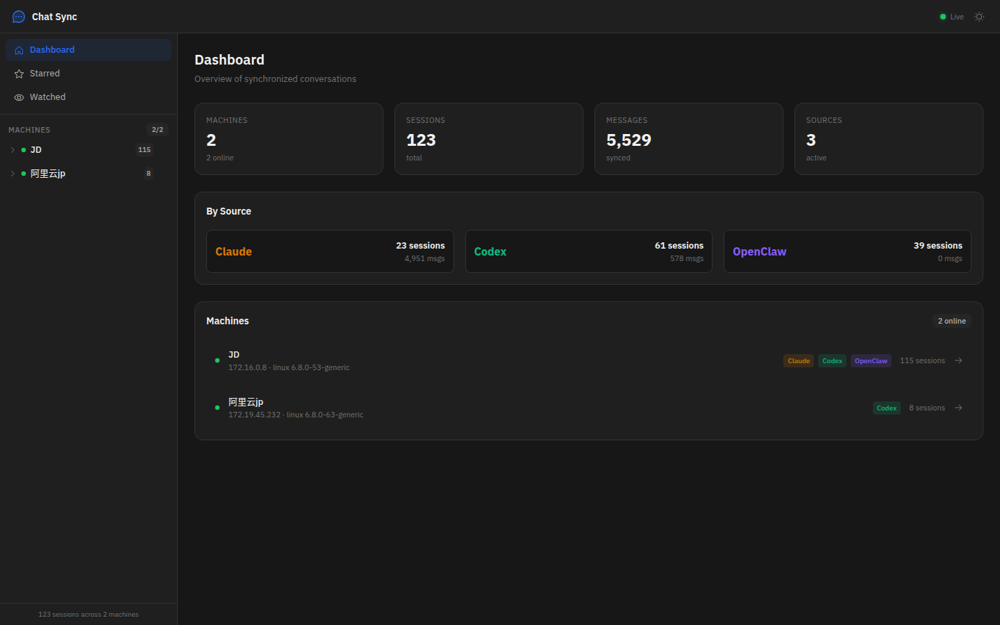
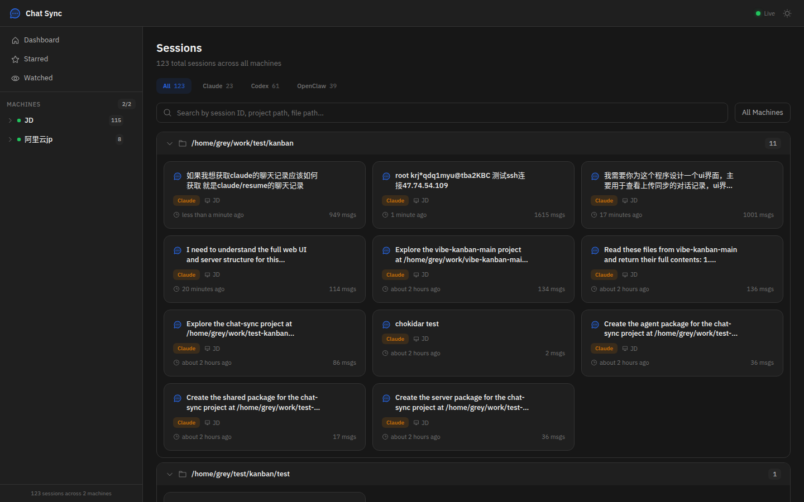
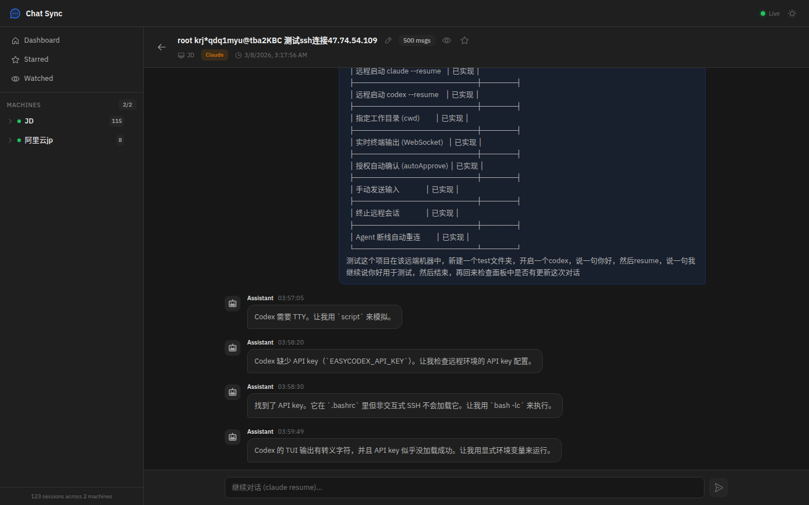

# Chat Sync Hub

Multi-machine AI chat history synchronization system. Collects and syncs conversation logs from **Claude Code** and **Codex** across multiple machines into a central dashboard with real-time updates.

## Screenshots

### Dashboard
Overview of all synchronized machines, sessions, and message statistics.



### Sessions
Browse all conversation sessions across machines, filtered by source (Claude/Codex), with search and project grouping.



### Session Detail
View full conversation history with message content, timestamps, and the ability to continue conversations remotely.



## Architecture

```
Machine A ──┐                                    ┌── Web Dashboard
Machine B ──┼── Agent (sync) ──▶ Central Server ──┤── REST API
Machine C ──┘   (chokidar)      (Fastify+SQLite)  └── WebSocket (live)
```

Each machine runs an **Agent** that watches local JSONL chat files and incrementally syncs new messages to a central **Server**. The server stores data in SQLite and pushes real-time updates to connected **Dashboard** clients via WebSocket.

## Features

- **Multi-source support** - Claude Code, Codex (GPT) sessions
- **Incremental sync** - Only reads new bytes from JSONL files using offset tracking
- **Real-time updates** - WebSocket push to dashboard on new messages
- **Multi-machine** - Unique machine ID + IP tracking, heartbeat monitoring
- **Remote execution** - Resume Claude/Codex sessions on remote machines via PTY
- **Auto-approve** - Automatically handles permission prompts during remote sessions
- **Systemd integration** - Production-ready with auto-restart and boot startup

## Quick Start

### 1. Install

```bash
git clone https://github.com/grey0758/chat-sync-hub.git
cd chat-sync-hub
npm install
npm run build
```

### 2. Start Server (on your central server)

```bash
PORT=3500 npx tsx packages/server/src/index.ts
```

### 3. Start Agent (on each development machine)

```bash
npx tsx packages/agent/src/index.ts --server http://YOUR_SERVER_IP:3500
```

### 4. Start Web Dashboard

```bash
cd packages/web && npx vite --host 0.0.0.0 --port 5173
```

Open `http://YOUR_SERVER_IP:5173` in your browser.

## Agent Options

| Parameter | Default | Description |
|---|---|---|
| `--server` | `http://localhost:3000` | Central server URL |
| `--dirs` | `~/.claude/projects,~/.codex/sessions` | Watch directories (comma-separated) |
| `--interval` | `3000` | Sync interval in ms |
| `--heartbeat` | `30000` | Heartbeat interval in ms |
| `--ssh-port` | `22` | SSH port (recorded for remote access) |
| `--ssh-user` | current user | SSH username |

## API Endpoints

| Method | Endpoint | Description |
|---|---|---|
| `GET` | `/api/machines` | List all registered machines |
| `GET` | `/api/sessions` | List all conversation sessions |
| `GET` | `/api/sessions/:id/messages` | Get messages (supports `?since=N` for incremental) |
| `GET` | `/api/messages/recent` | Recent messages across all sessions |
| `POST` | `/api/register` | Register a machine |
| `POST` | `/api/heartbeat` | Machine heartbeat |
| `POST` | `/api/sync` | Batch sync messages from agent |
| `POST` | `/api/remote/start` | Start remote Claude/Codex session |
| `POST` | `/api/remote/input` | Send input to remote session |
| `POST` | `/api/remote/kill` | Kill remote session |
| `GET` | `/api/remote/agents` | List connected agents |
| `WS` | `/ws/live` | Dashboard real-time updates |
| `WS` | `/ws/agent` | Agent command channel |

## Systemd Deployment

```bash
# Create service files (run as root)
# Server
cat > /etc/systemd/system/chat-sync-server.service << EOF
[Unit]
Description=Chat Sync Server
After=network.target
[Service]
Type=simple
User=YOUR_USER
WorkingDirectory=/path/to/chat-sync-hub
Environment=PORT=3500
Environment=PATH=/usr/local/bin:/usr/bin:/bin
ExecStart=/usr/local/bin/node --import file:///path/to/chat-sync-hub/node_modules/tsx/dist/loader.mjs packages/server/src/index.ts
Restart=always
RestartSec=5
[Install]
WantedBy=multi-user.target
EOF

# Agent
cat > /etc/systemd/system/chat-sync-agent.service << EOF
[Unit]
Description=Chat Sync Agent
After=network.target chat-sync-server.service
[Service]
Type=simple
User=YOUR_USER
WorkingDirectory=/path/to/chat-sync-hub
Environment=PATH=/usr/local/bin:/usr/bin:/bin
ExecStart=/usr/local/bin/node --import file:///path/to/chat-sync-hub/node_modules/tsx/dist/loader.mjs packages/agent/src/index.ts --server http://localhost:3500
Restart=always
RestartSec=5
[Install]
WantedBy=multi-user.target
EOF

# Enable and start
systemctl daemon-reload
systemctl enable --now chat-sync-server chat-sync-agent
```

## Project Structure

```
chat-sync-hub/
├── packages/
│   ├── shared/          # Shared TypeScript types
│   ├── server/          # Central server (Fastify + SQLite + WebSocket)
│   │   └── src/
│   │       ├── api/     # REST endpoints (sync, machines, query, remote)
│   │       ├── db/      # Drizzle ORM schema + SQLite
│   │       └── ws/      # WebSocket handlers (dashboard + agent)
│   ├── agent/           # Machine agent (file watcher + sync client)
│   │   └── src/
│   │       ├── parser.ts         # JSONL format parsers (Claude/Codex)
│   │       ├── watcher.ts        # chokidar file watcher
│   │       ├── reader.ts         # Incremental byte-offset reader
│   │       ├── uploader.ts       # Batch HTTP uploader
│   │       ├── command-channel.ts # WebSocket command receiver
│   │       └── remote-session.ts  # PTY-based remote execution
│   └── web/             # React dashboard (Vite + TailwindCSS)
└── data/                # SQLite database (auto-created)
```

## Tech Stack

- **Runtime**: Node.js + TypeScript
- **Server**: Fastify, better-sqlite3, Drizzle ORM
- **Agent**: chokidar (file watching), node-pty (remote execution)
- **Web**: React, Vite, TailwindCSS, Radix UI
- **Communication**: WebSocket (ws), REST API

## License

MIT
